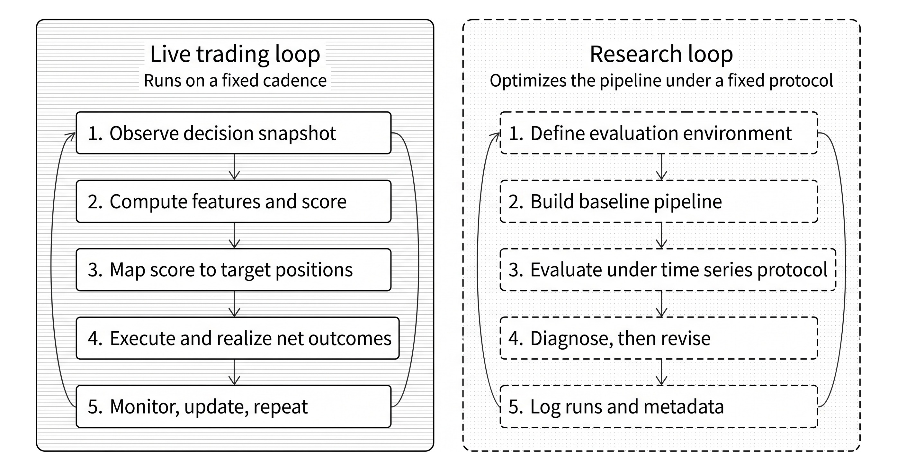

# Chapter 6: Strategy Research Framework

The chapter establishes the chapter's core claim: a trading strategy is not just a signal or model, but an executable decision process that has to be defined at decision time and evaluated as if it were live. It distinguishes the live trading loop from the research loop and shows why disciplined iteration matters if historical testing is supposed to say anything about future behavior. The case studies make the workflow concrete across asset classes, cadences, and market structures, so readers see early that the same research logic must survive very different implementation environments.



*The chapter separates the live trading loop from the research loop. The live loop runs on a fixed cadence; the research loop improves the pipeline under a fixed setup and evaluation protocol.*

## Learning Objectives

* Place a strategy idea on the strategy map by linking it to a strategy family, a plausible source of edge, and the dominant feasibility constraints and failure modes.
* Define a versioned trading setup in decision-time terms: what is tradable, when decisions are made, what information is admissible, how scores become positions, and which constraints and costs are treated as material.
* Define "better" economically and keep model diagnostics, signal diagnostics, and strategy outcomes in distinct roles during research and evaluation.
* Design a time-series evaluation protocol that preserves chronology, prevents overlap leakage, and separates model selection from final performance estimation.
* Establish a narrow baseline checkpoint with timing, coverage, and trading-intensity sanity checks before expanding the search space.
* Keep search auditable, reproducible, and countable using a simple trial taxonomy and automatic run logging.

## Sections

### 6.1 From Idea to Evidence with the ML4T Workflow

This section establishes the chapter's core claim: a trading strategy is not just a signal or model, but an executable decision process that has to be defined at decision time and evaluated as if it were live. It distinguishes the live trading loop from the research loop and shows why disciplined iteration matters if historical testing is supposed to say anything about future behavior. The case studies make the workflow concrete across asset classes, cadences, and market structures, so readers see early that the same research logic must survive very different implementation environments.

### 6.2 Mapping Strategies and Sources of Edge

This section gives readers a way to classify ideas before they start building models. Strategy families act as feasibility filters, while sources of edge act as durability filters: together they force the reader to ask not only whether a pattern can be backtested, but whether it is economically plausible, implementable, and likely to persist after costs, constraints, and competition. That makes this section important because it shifts strategy design away from loose narratives and toward testable economic hypotheses with explicit failure modes.

### 6.3 Defining the Trading Setup

Here the chapter turns the strategy map into a versioned trading setup. The key contribution is that comparability requires fixed invariants: tradability rules, decision schedule, score-to-trade mapping, constraints, and material cost components. The distinction between parameter tuning and mechanics changes is especially valuable because it gives readers a principled boundary for when they are still refining one strategy versus when they have quietly changed the structure of the strategy.

### 6.4 Setting Objectives and Evaluation Metrics

This section clarifies what "better" means in strategy research. Its main contribution is separating model diagnostics, signal diagnostics, and strategy outcomes so readers do not use one metric to answer incompatible questions. That separation matters because it reduces the temptation to optimize every micro-decision directly on simulated portfolio outcomes, which is one of the easiest ways to overfit a backtest.

### 6.5 Evaluation Protocol for Time Series

This is the chapter's methodological center. It explains why standard iid validation fails for financial time series, then introduces walk-forward evaluation, label and feature buffers, sealed holdouts, nested walk-forward, and combinatorial variants. Readers should care because this is the section that turns "out-of-sample" from a slogan into an actual protocol with admissibility rules, chronology, and governance around model selection versus final performance estimation.

### 6.6 Establishing a Baseline Checkpoint

This section argues that a narrow baseline is not a weak start but a governance tool. By insisting on timing, coverage, and trading-intensity sanity checks before large searches, it teaches readers how to rule out brittle setups early and earn the right to broaden the feature set or model class later. That is editorially strong because it frames baseline design as a way to avoid wasting effort on invalid or economically implausible research lines.

### 6.7 Search Accounting and Run Logging

This section makes experimentation auditable. Its value is not just reproducibility in the software-engineering sense, but countable search in the statistical sense: readers need to know what was tried, what was selected, and what was reserved for confirmation if they want performance claims to remain credible after iteration. The trial taxonomy is especially useful because it gives the book a concrete language for strategy, trial family, trial, and run.

## Notebooks

| Notebook                                                       | What it teaches                                                                                                          | Section |
|----------------------------------------------------------------|--------------------------------------------------------------------------------------------------------------------------|---------|
| [`01_cv_foundations`](01_cv_foundations.ipynb)                 | Walk-forward CV from first principles: decision-time admissibility, label buffer (purging), feature buffer (embargo), calendar-aware splits, nested walk-forward, and CPCV. | §6.5    |
| [`02_case_study_overview`](02_case_study_overview.ipynb)       | Cross-strategy summary of the nine case studies — asset classes, universes, cost classes, evaluation protocols, and prediction-coverage timeline (Figure 6.5). | §6.3    |

## Running the Notebooks

```bash
# From the repository root
uv run python 06_strategy_definition/<notebook>.py

# Test mode (reduced data via Papermill)
uv run pytest tests/test_notebooks.py -v -k "06_strategy_definition"
```

## References

- **Clifford S. Asness et al.** (2013). [Value and Momentum Everywhere](https://www.jstor.org/stable/42002613). *The Journal of Finance*.
- **David H. Bailey and Marcos Lopez de Prado** (2014). [The Deflated Sharpe Ratio: Correcting for Selection Bias, Backtest Overfitting and Non-Normality](https://doi.org/10.2139/ssrn.2460551).
- **David H. Bailey et al.** (2015). [The Probability of Backtest Overfitting](https://doi.org/10.2139/ssrn.2326253).
- **Stephen Bates et al.** (2021). [Cross-validation: what does it estimate and how well does it do it?](https://doi.org/10.1080/01621459.2023.2197686).
- **Christoph Bergmeir et al.** (2018). [A note on the validity of cross-validation for evaluating autoregressive time series prediction](https://doi.org/10.1016/j.csda.2017.11.003). *Computational Statistics & Data Analysis*.
- **Kent Daniel and Tobias J. Moskowitz** (2016). [Momentum crashes](https://doi.org/10.1016/j.jfineco.2015.12.002). *Journal of Financial Economics*.
- **R. David McLean and Jeffrey Pontiff** (2016). [Does Academic Research Destroy Stock Return Predictability?](https://doi.org/10.1111/jofi.12365). *Journal of Finance*.
- **Tobias J. Moskowitz et al.** (2011). [Time Series Momentum](https://doi.org/10.2139/ssrn.2089463).
- **Giuseppe A. Paleologo** (2025). The Elements of Quantitative Investing. *John Wiley & Sons*.
- **Marcos Lopez de Prado** (2018). Advances in Financial Machine Learning. *John Wiley & Sons*.
