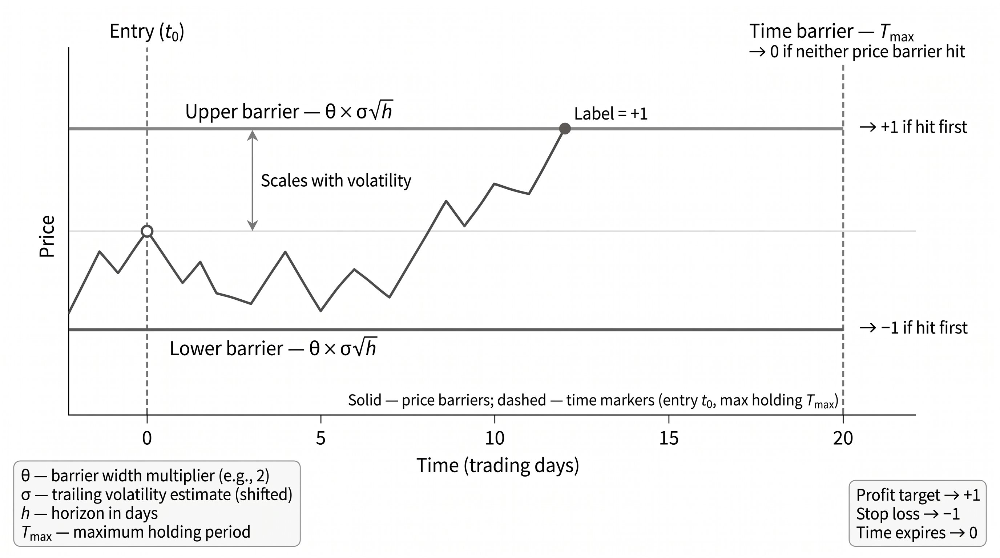

# Chapter 7: Defining the Learning Task

The chapter shows that feature research starts long before modeling. It turns raw but validated market data into stable, protocol-safe inputs by enforcing train-only fitting, disciplined outlier handling, explicit representation choices, and visible missing-data rules. The payoff is not cosmetic cleanliness but comparability, auditability, and protection against leakage that would otherwise make later signal evaluation meaningless.



*The triple-barrier method labels an event by whichever barrier is hit first: profit target, stop loss, or maximum holding period.*

## Learning Objectives

* Build split-aware preprocessing pipelines that produce stable, auditable inputs for label and feature computation.
* Define execution-consistent labels, including fixed-horizon and event-style constructions, and diagnose overlap, resolution behavior, and implied trading intensity.
* Evaluate feature-label bundles fold by fold using appropriate diagnostics for continuous and discrete targets, including stability, shape, and feasibility.
* Screen candidates for implementation feasibility using turnover, break-even cost, and liquidity or capacity checks.
* Account for search bias by defining searched sets, separating exploration from confirmation, and applying appropriate multiple-testing adjustments to fold-level summaries.
* Use mechanism plausibility checks to distinguish potentially stable signal channels from confounded proxies, timing artifacts, and aggregation effects.

## Sections

### 7.1 Data Preprocessing and Encodings

This section shows that feature research starts long before modeling. It turns raw but validated market data into stable, protocol-safe inputs by enforcing train-only fitting, disciplined outlier handling, explicit representation choices, and visible missing-data rules. The payoff is not cosmetic cleanliness but comparability, auditability, and protection against leakage that would otherwise make later signal evaluation meaningless.

- [`01_data_quality_diagnostics`](01_data_quality_diagnostics.ipynb) _(~9 GB RAM)_ — This notebook provides a standardized diagnostic survey across all ML4T datasets. No cleaning is performed—just assessment.
- [`02_preprocessing_pipeline`](02_preprocessing_pipeline.ipynb) _(~12 GB RAM)_ — This notebook implements hands-on cleaning for datasets that need it, plus demonstrates split-aware preprocessing mechanics. The key teaching artifact is the SplitAwarePreprocessor class that prevents lookahead bias.
- [`10_ml4t_library_ecosystem`](10_ml4t_library_ecosystem.ipynb) — This notebook introduces the ml4t library ecosystem used throughout Chapters 7-12: data loaders (ml4t-data), feature computation (ml4t-engineer), and evaluation tools (ml4t-diagnostic). Uses etfs data.

### 7.2 Label Engineering

This section defines the prediction target with trading realism in mind. It moves from execution-consistent fixed-horizon labels to thresholded, adaptive, and event-style labels, then shows how overlap, resolution time, and implied trading intensity shape what the labels actually mean in practice. Readers should care because a one-bar timing mismatch, a poor threshold choice, or ignored overlap can manufacture a signal that will disappear the moment it meets live execution.

- [`03_label_methods`](03_label_methods.ipynb) — This notebook demonstrates all major labeling methods for ML-based trading strategies, with practical examples on real ETF data. It serves as the canonical reference for choosing and configuring labels across all modeling chapters.
- [`04_maximum_favorable_adverse_excursion`](04_maximum_favorable_adverse_excursion.ipynb) — This notebook provides empirical justification for triple-barrier parameter choices. Rather than picking arbitrary barrier widths, we analyze actual price excursions to determine appropriate thresholds.
- `case_studies/etfs/02_labels`
- `case_studies/crypto_perps_funding/02_labels`
- `case_studies/nasdaq100_microstructure/02_labels`
- `case_studies/sp500_equity_option_analytics/02_labels`
- `case_studies/cme_futures/02_labels`
- `case_studies/sp500_options/02_labels`
- `case_studies/us_equities_panel/02_labels`
- `case_studies/us_firm_characteristics/02_labels`
- `case_studies/fx_pairs/02_labels`

### 7.3 Univariate Feature-Label Evaluation

This section builds the book's first serious triage layer for candidate signals. It asks, in order, whether a feature is correct at decision time, associated with the label, shaped in a way that supports plausible mapping to positions, and economically feasible once turnover, costs, and liquidity are considered. Its importance is that it reframes factor research as an auditable screening process rather than a hunt for a single attractive statistic.

- [`05_signal_evaluation`](05_signal_evaluation.ipynb) — This notebook demonstrates single-factor evaluation using Information Coefficient (IC) analysis, quantile returns, and spread metrics. We answer: "Is this factor predictive in the cross-section, and what horizon does it live on?" Uses etfs data.
- [`06_ic_inference`](06_ic_inference.ipynb) — This notebook addresses statistical inference for IC: how confident should we be that a signal's IC is not just noise? We cover HAC adjustment for autocorrelated IC series and block bootstrap for robust confidence intervals.

### 7.4 Search Accounting and Multiple Testing

This section addresses one of the central failure modes of quantitative research: believing the best candidate after a large search. By defining the searched set, separating exploration from confirmation, and introducing FWER and FDR-style corrections, it makes clear that significance depends on how many variants were tried and how they were chosen. Readers should care because this is where the chapter turns anti-overfitting from a slogan into a concrete research accounting discipline.

- [`07_multiple_testing`](07_multiple_testing.ipynb) — This notebook addresses the factor zoo problem: when testing many signals, even with proper inference, the "best" will be inflated by selection bias. We cover FDR control and complexity-aware corrections.

### 7.5 From Correlation to Causality

This section introduces causal thinking as a falsification layer for features that survived statistical screening. Using small DAGs and mechanism plausibility checks, it asks whether a signal reflects a durable channel or merely a confounded proxy, timing artifact, or aggregation mistake. The value for the reader is not that it "proves causality," but that it helps reject weak stories early and carry better-specified hypotheses into later multivariate work.

- [`08_causal_sanity_checks`](08_causal_sanity_checks.ipynb) — This notebook implements lightweight falsification tests for feature evaluation. These tests complement the correlation-based IC analysis from Section 7.3 by checking whether a feature-outcome association is consistent with a proposed mechanism.

## Running the Notebooks

```bash
# From the repository root
uv run python 07_defining_the_learning_task/<notebook>.py

# Test mode (reduced data via Papermill)
uv run pytest tests/test_notebooks.py -v -k "07_defining_the_learning_task"
```

### Memory and runtime callouts

> Memory: `01_data_quality_diagnostics` peaks at ~9 GB RSS; recommend ≥16 GB system RAM.
> Memory: `02_preprocessing_pipeline` peaks at ~12 GB RSS; recommend ≥24 GB system RAM.
> Runtime: `08_causal_sanity_checks` takes ~6 minutes (200-permutation null across multiple features and horizons).
