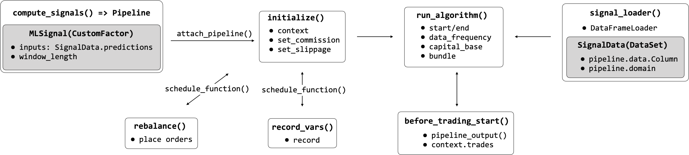
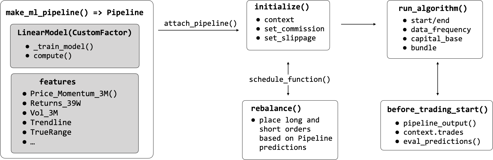

# Zipline: Production-ready backtesting by Quantopian

The backtesting engine Zipline powers Quantopian’s online research, backtesting, and live (paper) trading platform. As a hedge fund, Quantopian aims to identify robust algorithms that outperform, subject to its risk management criteria. To this end, they have used competitions to select the best strategies and allocate capital to share profits with the winners.

Quantopian first released Zipline in 2012 as version 0.5, and the latest version 1.3 dates from July 2018. Zipline works well with its sister libraries [Alphalens](https://quantopian.github.io/alphalens/index.html), [pyfolio](https://quantopian.github.io/pyfolio/), and [empyrical](http://quantopian.github.io/empyrical/) that we introduced in Chapters 4 and 5 and integrates well with NumPy, pandas and numeric libraries, but may not always support the latest version.

## Content

1. [Installation](#installation)
2. [Zipline Architecture](#zipline-architecture)
3. [Exchange calendars and the Pipeline API for robust simulations](#exchange-calendars-and-the-pipeline-api-for-robust-simulations)
    * [Bundles and friends: Point-in-time data with on-the-fly adjustments](#bundles-and-friends-point-in-time-data-with-on-the-fly-adjustments)
    * [The Algorithm API: Backtests on a schedule](#the-algorithm-api-backtests-on-a-schedule)
    * [Known Issues](#known-issues)
4. [Code Example: How to load your own OHLCV bundles with minute data](#code-example-how-to-load-your-own-ohlcv-bundles-with-minute-data)
    * [Getting AlgoSeek data ready to be bundled](#getting-algoseek-data-ready-to-be-bundled)
    * [Writing your custom bundle ingest function](#writing-your-custom-bundle-ingest-function)
    * [Registering your bundle](#registering-your-bundle)
    * [Creating and registering a custom TradingCalendar](#creating-and-registering-a-custom-tradingcalendar)
5. [Code Example: The Pipeline API - Backtesting a machine learning signal](#code-example-the-pipeline-api---backtesting-a-machine-learning-signal)
6. [Code Example: How to train a model during the backtest](#code-example-how-to-train-a-model-during-the-backtest)
7. [Code Example: How to use the research environment on Quantopian](#code-example-how-to-use-the-research-environment-on-quantopian)

## Installation

Please follow the instructions in the [installation](../../installation/) directory to use the patched Zipline version that we'll use for the examples in this book.

> To run the code examples in this section, activate the `ml4t-zipline` `conda` environment, or otherwise install and use the patched Zipline version reference above.  

## Zipline Architecture

Zipline is designed to operate at the scale of thousands of securities, and each can be associated with a large number of indicators. It imposes more structure on the backtesting process than backtrader to ensure data quality by eliminating look-ahead bias, for example, and optimize computational efficiency while executing a backtest. 

This section of the book takes a closer look at the key concepts and elements of the architecture shown in the following Figure before demonstrating how to use Zipline to backtest ML-driven models on the data of your choice.

## Exchange calendars and the Pipeline API for robust simulations

Key features that contribute to the goals of scalability and reliability are data bundles that store OHLCV market data with on-the-fly adjustments for splits and dividends, trading calendars that reflect operating hours of exchanges around the world, and the powerful Pipeline API. This section outlines their usage to complement the brief Zipline introduction in earlier chapters.

### Bundles and friends: Point-in-time data with on-the-fly adjustments

The principal data store is a **bundle** that resides on disk in compressed, columnar [bcolz](https://bcolz.readthedocs.io/en/latest/) format for efficient retrieval, combined with metadata stored in an SQLite database. Bundles are designed to contain only OHLCV data and are limited to daily and minute frequency. A great feature is that bundles store split and dividend information, and Zipline computes **point-in-time adjustments** depending on the time period you pick for your backtest. 

Zipline relies on the [Trading Calendars](https://www.zipline.io/trading-calendars.html) library (also maintained by Quantopian) for operational details on exchanges around the world, such as time zone, market open and closing times, or holidays. Data sources have domains (for now, these are countries) and need to conform to the assigned exchange calendar. Quantopian is actively developing support for international securities, and these features may evolve.

After installation, the command `zipline ingest -b bundle` lets you install the Quandl Wiki dataset (daily frequency) right away. The result ends up in the `.zipline` directory that by default resides in your home folder but can modify the location by setting the `ZIPLINE_ROOT` environment variable . In addition, you can design your own bundles with OHLCV data.

 A shortcoming of bundles is that they do not let you store data other than price and volume information. However, two alternatives let you accomplish this: the `fetch_csv()` function downloads DataFrames from a URL and was designed for other Quandl data sources, e.g. fundamentals. Zipline reasonably expects the data to refer to the same securities for which you have provided OHCLV data and aligns the bars accordingly. It’s not very difficult to make minor changes to the library's source code to load from local CSV or HDF5 using pandas instead, and the [patched version](https://github.com/stefan-jansen/zipline) included in the `conda` environment `ml4t-zipline` includes this modification. 

In addition, the `DataFrameLoader` and the `BlazeLoader` permit you to feed additional attributes to a `Pipeline` (see the `DataFrameLoader` demo later in the chapter). The `BlazeLoader` can interface with numerous sources, including databases. However, since the Pipeline API is limited to daily data, `fetch_csv()` will be critical to adding features at minute frequency as we will do in later chapters.

### The Algorithm API: Backtests on a schedule

The `TradingAlgorithm` class implements the Zipline Algorithm API and operates on `BarData` that has been aligned with a given trading calendar. After the initial setup, the backtest runs for a specified period and executes its trading logic as specific events occur. These events are driven by the daily or minutely trading frequency, but you can also **schedule arbitrary functions** to evaluate signals, place orders, and rebalance your portfolio, or log information about the ongoing simulation.

You can execute an algorithm from the command line, in a Jupyter Notebook, and by using the `run_algorithm()` method of the underlying TradingAlgorithm class. The algorithm requires an `initialize()` method that is called once when the simulation starts. It keeps state through a `context` dictionary and receives actionable information through a `data` variable containing point-in-time (PIT) current and historical data. You can add properties to the context dictionary which is available to all other `TradingAlgorithm` methods or register pipelines that perform more complex data processing, such as computing alpha factors and filtering securities.

Algorithm execution occurs through optional methods that are either scheduled automatically by Zipline or at user-defined intervals. The method `before_trading_start()` is called daily before the market opens and primarily serves to identify a set of securities the algorithm may trade during the day. The method `handle_data()` is called at the given trading frequency, e.g. every minute. 

Upon completion, the algorithm returns a DataFrame containing portfolio performance metrics if there were any trades, as well as user-defined metrics. As demonstrated in [Chapter 5](../../05_strategy_evaluation), the output is compatible with [pyfolio](https://quantopian.github.io/pyfolio/) so that you can create quickly create performance tearsheets.

### Known Issues

[Live trading](https://github.com/zipline-live/zipline) your own systems is only available with Interactive Brokers and not fully supported by Quantopian.

## Code Example: How to load your own OHLCV bundles with minute data

We will use the NASDAQ100 sample provided by AlgoSeek that we introduced in [Chapter 2](../../02_market_and_fundamental_data/02_algoseek_intraday) to demonstrate how to write your own custom bundle for data at **minute frequency**. See [Chapter 11](../../11_decision_trees_random_forests/00_custom_bundle) for an example using daily data on Japanese equities. 

There are four steps:

1. Split your OHCLV data into one file per ticker and store metadata, split and dividend adjustments.
2. Write a script to pass the result to an `ingest()` function that in turn takes care of writing the bundle to bcolz and SQLite format.
3. Register the bundle in an `extension.py` script that lives in your `ZIPLINE_ROOT/.zipline` directory (per default in your user's home folder), and symlink the data sources.
4. For AlgoSeek data, we also provide a custom `TradingCalendar` because it includes trading activity outside the standard NYSE market hours.

The directory [custom_bundles](01_custom_bundles) contains the code examples. 

### Getting AlgoSeek data ready to be bundled

In [Chapter 2](../../02_market_and_fundamental_data/02_algoseek_intraday), we parsed the daily files containing the AlgoSeek NASDAQ 100 OHLCV data to obtain a time series for each ticker. We will use this result because Zipline also stores each security individually.

In addition, we obtain equity metadata using the [pandas-dataReader](https://pandas-datareader.readthedocs.io/en/latest/) `get_nasdaq_symbols()` function. Finally, since the Quandl Wiki data covers the NASDAQ 100 tickers for the relevant period, we extract the split and dividend adjustments from that bundle’s SQLite database.

The result is an HDF5 store `algoseek.h5` containing price and volume data on some 135 tickers as well as the corresponding meta and adjustment data. The script [algoseek_preprocessing](algoseek_preprocessing.py] illustrates the process.

### Writing your custom bundle ingest function

The Zipline [documentation](https://www.zipline.io/bundles.html#writing-a-new-bundle) outlines the required parameters for an `ingest()` function that kicks off the I/O process but does not provide a lot of practical detail. The script `algoseek_1min_trades.py` shows how to get this part to work for minute data.

In a nutshell, there is a `load_equities()` function that provides the metadata, a `ticker_generator()` function that feeds symbols to a `data_generator()` which in turn loads and format each symbol’s market data, and an `algoseek_to_bundle()` function that integrates all pieces and returns the desired `ingest()` function. 

Time zone alignment matters because Zipline translates all data series to UTC; we add `US/Eastern` time zone information to the OHCLV data and convert it to UTC. To facilitate execution, we create symlinks for this script and the `algoseek.h5` data in the `custom_data` folder in the `.zipline` directory that we’ll add to the PATH in the next step so Zipline finds this information. To this end, we run the following shell commands:

1. Assign the absolute path to this directory to `SOURCE_DIR`: `export SOURCE_DIR = absolute/path/to/machine-learning-for-trading/08_strategy_workflow/04_ml4t_workflow_with_zipline/01_custom_bundles`
2. create symbolic link to 
    - `algoseek.h5` in `ZIPLINE_ROOT/.zipline`: `ln -s SOURCE_DIR/algoseek.h5 $ZIPLINE_ROOT/.zipline/custom_data/.`
    - `algoseek_1min_trades.py`: `ln -s SOURCE_DIR/algoseek_1min_trades.py $ZIPLINE_ROOT/.zipline/.`

### Registering your bundle

Before we can run `zipline ingest -b algoseek`, we need to register our custom bundle so Zipline knows what we are talking about. To this end, we’ll add the following lines to an `extension.py` script in the `.zipline` directory. You may have to create this file alongside some inputs and settings (see the [extension](extension.py) example).

The registration itself is fairly straightforward but highlights a few important details:
1. Zipline needs to be able to import the `algoseek_to_bundle()` function, so its location needs to be on the search path, e.g. by using `sys.path.append()`. 
2. We reference a custom calendar that we will create and register in the next step. 
3. We need to inform Zipline that our trading days are longer than the default six and a half hours of NYSE days to avoid misalignments.

### Creating and registering a custom TradingCalendar

As mentioned in the introduction to this section, Quantopian also provides a `Trading Calendar` library to support trading around the world. The package contains numerous examples that are fairly straightforward to subclass. Based on the NYSE calendar, we only need to override the open/close times, place the result in `extension.py`, and add a registration for this calendar. And now we can refer to this trading calendar to ensure a backtest includes off-market-hour activity.

## Code Example: The Pipeline API - Backtesting a machine learning signal

The [Pipeline API](https://www.quantopian.com/docs/user-guide/tools/pipeline) facilitates the definition and computation of alpha factors for a cross-section of securities from historical data. The Pipeline significantly improves efficiency because it optimizes computations over the entire backtest period rather than tackling each event separately. In other words, it continues to follow an event-driven architecture but vectorizes the computation of factors where possible. 

A Pipeline uses Factors, Filters, and Classifiers classes to define computations that produce columns in a table with PIT values for a set of securities. Factors take one or more input arrays of historical bar data and produce one or more outputs for each security. There are numerous built-in factors, and you can also design your own `CustomFactor` computations.

The following figure depicts how loading the data using the `DataFrameLoader`, computing the predictive `MLSignal` using the Pipeline API, and various scheduled activities integrate with the overall trading algorithm executed via the `run_algorithm()` function. We go over the details and the corresponding code in this section.

You need to register your Pipeline with the `initialize()` method and can then execute it at each time step or on a custom schedule. Zipline provides numerous built-in computations such as moving averages or Bollinger Bands that can be used to quickly compute standard factors, but it also allows for the creation of custom factors as we will illustrate next. 

Most importantly, the Pipeline API renders alpha factor research modular because it separates the alpha factor computation from the remainder of the algorithm, including the placement and execution of trade orders and the bookkeeping of portfolio holdings, values, and so on.

The notebook [backtesting_with_zipline](04_ml4t_workflow_with_zipline/02_backtesting_with_zipline.ipynb) demonstrates the use of the `Pipeline` interface while loading ML predictions from another local (HDF5) data source. More specifically, it loads the lasso model daily return predictions generated in [Chapter 7](../../07_linear_models) together with price data for our universe into a Pipeline and uses a `CustomFactor` to select the top and bottom 10 predictions as long and short positions, respectively. 

The goal is to combine the daily return predictions with the OHCLV data from our Quandl bundle and then to go long on up to 10 equities with the highest predicted returns and short on those with the lowest predicted returns, requiring at least five stocks on either side similar to the backtrader example above. See comments in the notebook for implementation details.

## Code Example: How to train a model during the backtest

We can also integrate the model training into our backtest. You can find the code for the following end-to-end example of our ML4T workflow in the ml4t_with_zipline notebook.

The notebook [ml4t_with_zipline](04_ml4t_workflow_with_zipline/03_ml4t_with_zipline.ipynb) shows how to train an ML model locally as part of a `Pipeline` using a `CustomFactor` and various technical indicators as features for daily `bundle` data using the workflow displayed in the following figure:

The goal is to roughly replicate the daily return predictions we used in the previous and generated in [Chapter 7](../../07_linear_models). We will, however, use a few additional Pipeline factors to illustrate their usage. 

The principal new element is a `CustomFactor` that receives features and returns as inputs to train a model and produce predictions. See notebook for comments on implementation.

## Code Example: How to use the research environment on Quantopian

The notebook [ml4t_quantopian](04_ml4t_quantopian.ipynb) shows how to train an ML model on the Quantopian platform to utilize the broad range of data sources available there.
