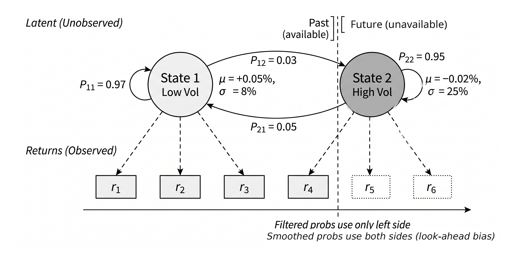

# Chapter 9: Model-Based Feature Extraction

The chapter reframes diagnostics as more than preprocessing checks. Stationarity tests, break diagnostics, and fractional differencing become feature generators in their own right, helping the reader think about persistence, structural instability, and memory preservation as inputs to downstream models rather than as one-time gates before modeling begins. It matters because many financial series are only usable once we understand what kind of temporal object they are and how much transformation is justified.

<p align="center">
  
</p>

<p align="center"><em>Regime models turn latent market states into filtered probabilities that can be used as features without looking into the future.</em></p>

## Learning Objectives

* distinguish direct features from model-based features and judge when a fitted procedure adds useful information beyond
  direct transformations
* use fitted procedures to extract forecasts, filtered states, residuals, conditional volatility, regime probabilities,
  and uncertainty summaries as downstream features
* design a compact, interpretable set of model-based features from diagnostics, signal transforms, volatility models,
  uncertainty summaries, and regime models
* enforce point-in-time correctness by fitting and selecting models within training windows, using filtered rather than
  future-informed outputs, and aligning refit cadence and online updates with the walk-forward protocol
* transform asset-level temporal outputs into cross-sectional, benchmark-adjusted, pairwise, and universe-level features
  for multi-asset prediction tasks
* distinguish between exploratory time-series methods that are useful for research diagnosis and deployable features
  that are safe for live, point-in-time use
* use uncertainty and regime outputs primarily as conditioning features, and recognize when they should not be treated
  as stand-alone trading signals

## Sections

### 9.1 Diagnostics and Stationarity Features

This section reframes diagnostics as more than preprocessing checks. Stationarity tests, break diagnostics, and fractional differencing become feature generators in their own right, helping the reader think about persistence, structural instability, and memory preservation as inputs to downstream models rather than as one-time gates before modeling begins. It matters because many financial series are only usable once we understand what kind of temporal object they are and how much transformation is justified.

- [`01_visual_diagnostics`](01_visual_diagnostics.ipynb) — This notebook demonstrates the complete diagnostic workflow for financial time series: visual inspection, stationarity tests, autocorrelation analysis, and rolling diagnostic features. Uses etfs, macro data.
- [`02_structural_breaks`](02_structural_breaks.ipynb) — This notebook demonstrates classical and ML-based methods for detecting structural breaks in financial time series. Uses etfs data.
- [`03_fractional_differencing`](03_fractional_differencing.ipynb) — This notebook demonstrates fractional differentiation (FFD), a technique that achieves stationarity while preserving as much memory as possible. Uses etf_data, etfs data.

### 9.2 Transforming Signals to Uncover Hidden Structure

This section shows why rolling statistics are often too lossy for serious temporal feature engineering. Kalman filters, spectral methods, wavelets, and path signatures each recover a different hidden aspect of sequential structure: latent state, cycles, scale-localized behavior, and path geometry. Readers should care because this is where the chapter moves beyond familiar moving averages and rolling vol into genuinely richer representations of time series, while still keeping causal deployment constraints in view.

- [`04_kalman_filter`](04_kalman_filter.ipynb) — This notebook demonstrates the Kalman filter as a production feature extractor: level estimation, trend detection, innovation (surprise) signals, and dynamic hedge ratio estimation. Uses etfs data.
- [`05_spectral_features`](05_spectral_features.ipynb) — This notebook demonstrates frequency-domain feature engineering: wavelet decomposition for multi-resolution analysis, rolling FFT for production spectral features, and Welch's method for robust power spectral density estimation. Uses etfs data.
- [`06_path_signatures`](06_path_signatures.ipynb) — > Docker required: This notebook uses esig, which is an x86-only package > not included in the default environment. Run with: > `bash > docker compose --profile py312 run --rm py312 python 09_model_based_features/06_path_signatures.py > ` Uses etfs data.

### 9.3 Volatility Features

This is one of the chapter's strongest sections because it treats volatility as the most forecastable part of the problem and shows how fitted models convert that predictability into usable features. ARIMA residuals, GARCH-family outputs, HAR coefficients, and roughness measures all become summaries of persistence, asymmetry, and horizon structure rather than isolated econometric artifacts. Readers should care because these are practical building blocks for both prediction and risk-sensitive downstream decisions.

- [`07_arima_features`](07_arima_features.ipynb) — This notebook demonstrates ARIMA as a feature extractor rather than a standalone forecaster. The key outputs — residuals, forecast values, and forecast uncertainty — feed into downstream ML pipelines.
- [`08_garch_volatility`](08_garch_volatility.ipynb) — This notebook extracts volatility features from GARCH family models: conditional volatility, persistence parameters, and leverage effects. Uses etfs, symbol_returns data.
- [`09_har_rough_volatility`](09_har_rough_volatility.ipynb) — This notebook covers multi-horizon volatility modeling and the Hurst exponent as features for ML trading systems. Uses etfs data.

### 9.4 Uncertainty Features

This section makes an important conceptual move: the model's uncertainty is itself informative. Posterior widths, forecast standard errors, and interval widths help distinguish between a strong estimate and a weakly identified one, even when the point forecast is the same. That matters in trading because signal strength, sizing, and interpretation should depend not only on what the model predicts, but also on how confident the model is.

- [`10_uncertainty_features`](10_uncertainty_features.ipynb) — This notebook demonstrates Bayesian and frequentist approaches to extracting uncertainty features — posterior distributions and prediction intervals become ML inputs, not just diagnostics. Uses etfs data.

### 9.5 Regime Features

This section explains how changing market environments can be encoded as features, ranging from transparent threshold rules to HMMs, Markov-switching models, and distribution-based clustering. Its most valuable message is that regime information is usually better used as soft conditioning input than as a brittle hard switch between separate models. Readers should care because regime awareness often changes how other signals should be interpreted, especially near transitions and stress episodes.

- [`11_hmm_regimes`](11_hmm_regimes.ipynb) — This notebook provides a thorough introduction to HMMs for financial regime detection, from first principles through production considerations. Uses etfs, macro data.
- [`12_wasserstein_regimes`](12_wasserstein_regimes.ipynb) — This notebook implements the methodology from "Clustering Market Regimes Using the Wasserstein Distance" (Horvath et al., 2021). Instead of clustering on moment features (mean, variance, skewness), each time window is treated as an empirical distribution and clustered using optimal transport.
- [`13_regime_as_feature`](13_regime_as_feature.ipynb) — This notebook demonstrates the regime-as-feature methodology: using regime probabilities as input features to ML models, rather than switching between specialized models based on detected regime. Uses etfs, macro data.

### 9.6 Cross-Sectional and Panel Features

Here the chapter bridges from asset-by-asset temporal modeling to the multi-asset workflow used later in the book. Raw temporal outputs become more useful once ranked across the universe, benchmark-adjusted, translated into pairwise states, or aggregated into market-wide summaries. This section matters because it turns model-based feature engineering from a single-series exercise into something usable for real cross-sectional prediction and portfolio construction.

- [`14_panel_features`](14_panel_features.ipynb) — This notebook demonstrates panel-level temporal features: pairwise relationships (cointegration, Kalman hedge ratios, O-U half-life) and cross-sectional transforms (ranking, relative features, universe aggregation). Uses etfs data.

## Running the Notebooks

```bash
# From the repository root
uv run python 09_model_based_features/<notebook>.py

# Test mode (reduced data via Papermill)
uv run pytest tests/test_notebooks.py -v -k "09_model_based_features"
```

> Runtime: `07_arima_features` ~1-2 min, `10_uncertainty_features` ~3 min (PyMC NUTS sampling); all other notebooks <40 s on a laptop.
>
> `06_path_signatures` requires the `ml4t-py312` Docker image (the `esig` library is x86-only and not in the default environment):
>
> ```bash
> docker compose --profile py312 run --rm py312 \
>     python 09_model_based_features/06_path_signatures.py
> ```

## References

- **Andrew Ang and Geert Bekaert** (2002). [International Asset Allocation With Regime Shifts](https://doi.org/10.1093/rfs/15.4.1137). *Review of Financial Studies*.
- **Andrew Ang and Allan Timmermann** (2011). [Regime Changes and Financial Markets](https://doi.org/10.2139/ssrn.1919497).
- **Michael Betancourt** (2018). [A Conceptual Introduction to Hamiltonian Monte Carlo](http://arxiv.org/abs/1701.02434). *arXiv:1701.02434 [stat]*.
- **Tim Bollerslev** (1986). [Generalized autoregressive conditional heteroskedasticity](https://doi.org/10.1016/0304-4076(86)90063-1). *Journal of Econometrics*.
- **Ilya Chevyrev et al.** (2026). [A Primer on the Signature Method in Machine Learning](https://doi.org/10.1007/978-3-031-97239-3_1). *Springer Nature Switzerland*.
- **Fulvio Corsi** (2009). [A Simple Approximate Long-Memory Model of Realized Volatility](https://doi.org/10.1093/jjfinec/nbp001). *Journal of Financial Econometrics*.
- **Robert F. Engle** (1983). [Estimates of the Variance of U. S. Inflation Based upon the ARCH Model](https://doi.org/10.2307/1992480). *Journal of Money, Credit and Banking*.
- **Robert F. Engle and C. W. J. Granger** (1987). [Co-Integration and Error Correction: Representation, Estimation, and Testing](https://doi.org/10.2307/1913236). *Econometrica*.
- **Mark B. Garman and Michael J. Klass** (1980). [On the Estimation of Security Price Volatilities from Historical Data](https://www.jstor.org/stable/2352358). *The Journal of Business*.
- **Jim Gatheral et al.** (2014). [Volatility is rough](https://doi.org/10.48550/arXiv.1410.3394).
- **James D. Hamilton** (1989). [A New Approach to the Economic Analysis of Nonstationary Time Series and the Business Cycle](https://doi.org/10.2307/1912559). *Econometrica*.
- **Matthew D. Hoffman and Andrew Gelman** (2011). [The No-U-Turn Sampler: Adaptively Setting Path Lengths in Hamiltonian Monte Carlo](http://arxiv.org/abs/1111.4246). *arXiv:1111.4246 [cs, stat]*.
- **Blanka Horvath et al.** (2021). [Clustering Market Regimes Using the Wasserstein Distance](https://doi.org/10.2139/ssrn.3947905).
- **Søren Johansen and Katarina Juselius** (1990). [Maximum Likelihood Estimation and Inference on Cointegration — with Applications to the Demand for Money](https://doi.org/10.1111/j.1468-0084.1990.mp52002003.x). *Oxford Bulletin of Economics and Statistics*.
- **Stephen Marra** (2023). [Time-Series Techniques: Estimating Volatility](https://doi.org/10.3905/jpm.2023.1.475). *The Journal of Portfolio Management*.
- **Alan Moreira and Tyler Muir** (2017). [Volatility-Managed Portfolios](https://doi.org/10.1111/jofi.12513). *The Journal of Finance*.
- **Daniel B. Nelson** (1991). [Conditional Heteroskedasticity in Asset Returns: A New Approach](https://doi.org/10.2307/2938260). *Econometrica*.
- **Marcos Lopez de Prado** (2018). Advances in Financial Machine Learning. *John Wiley & Sons*.
- **Yizhan Shu and John M. Mulvey** (2025). [Dynamic Factor Allocation Leveraging Regime-Switching Signals](https://doi.org/10.3905/jpm.2024.1.649). *The Journal of Portfolio Management*.
- **Sophia Sun and Rose Yu** (2025). [Conformal Prediction for Time-series Forecasting with Change Points](https://doi.org/10.48550/arXiv.2509.02844).
- **A. Sinem Uysal and John M. Mulvey** (2021). [A Machine Learning Approach in Regime-Switching Risk Parity Portfolios](https://doi.org/10.3905/jfds.2021.1.057). *The Journal of Financial Data Science*.
- **Dennis Yang and Qiang Zhang** (2000). [Drift‐Independent Volatility Estimation Based on High, Low, Open, and Close Prices](https://doi.org/10.1086/209650). *The Journal of Business*.
