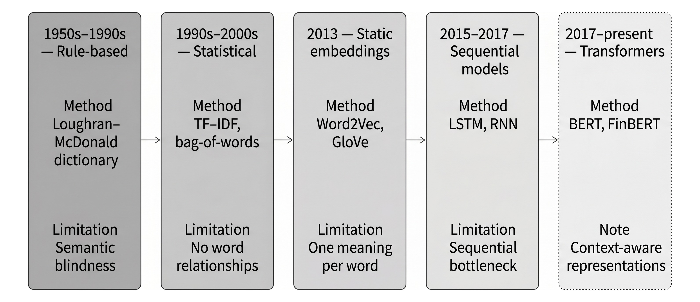

# Chapter 10: Text Feature Engineering

The chapter establishes the baseline methods that made large-scale financial text analysis possible: lexicons, bag-of-words, and TF-IDF. It matters because it shows both why these methods remain useful and why they are not enough for modern trading use cases: they are fast, interpretable, and domain-adaptable, but they cannot represent context, synonymy, negation, or changing meaning across uses.



*Financial text features have moved from dictionaries and bag-of-words toward contextual Transformer representations such as BERT and FinBERT.*

## Learning Objectives

- Distinguish lexical features, static embeddings, sequential models, and Transformers in terms of the information each representation preserves and loses
- Explain how Transformer self-attention produces contextual embeddings and why this resolves key limitations of earlier NLP methods, including polysemy and long-range dependence
- Apply a practical financial NLP workflow that combines pre-trained checkpoints, domain adaptation when needed, and task fine-tuning for classification or extraction tasks
- Design text-derived features such as sentiment, narrative surprise, or structured event signals using point-in-time-safe timestamps, model cutoffs, and aggregation rules
- Evaluate text-derived signals using horizon-aware diagnostics, coverage-aware analysis, and event-time alignment rather than benchmark accuracy alone
- Use token-level attribution and related diagnostics to audit, debug, and stress-test NLP features before deployment

## Sections

### 10.1 Lexical and Statistical Models

This section establishes the baseline methods that made large-scale financial text analysis possible: lexicons, bag-of-words, and TF-IDF. It matters because it shows both why these methods remain useful and why they are not enough for modern trading use cases: they are fast, interpretable, and domain-adaptable, but they cannot represent context, synonymy, negation, or changing meaning across uses.

### 10.2 Static Embeddings

This section explains the first major leap beyond counting words: learning dense semantic representations from co-occurrence. It matters because it introduces the core intuition behind modern representation learning and shows that the same logic can extend beyond text, as in asset embeddings learned from portfolio holdings. At the same time, it makes clear why static embeddings are still only an intermediate step: one vector per word is not enough for finance, where context changes meaning constantly.

### 10.3 Sequential Models

This section gives readers the missing bridge between static embeddings and Transformers. It matters because it explains what RNNs and LSTMs solved, what they could not solve, and why the field moved on. The reader should care because this is the architectural turning point: once long-range dependence, sequential computation, and scaling become bottlenecks, Transformer-style attention stops being a technical curiosity and becomes the practical default.

### 10.4 Transformers

This section is the chapter's conceptual center of gravity on model architecture. It explains self-attention, multi-head attention, positional encoding, BERT-style encoders, finance-specific checkpoints, and the practical consequences of domain adaptation, fine-tuning, and model choice. Readers should care because this is where the chapter moves from general NLP history to the modern tools that actually power financial text classification, embedding generation, and representation-based feature engineering.

### 10.5 The Modern Feature Extraction Workflow

This is the chapter's real practical core. It explains that a strong text model is not yet a tradable signal unless timestamps, entity resolution, revisions, aggregation rules, model training cutoffs, and evaluation protocols are all made point-in-time safe. It also connects representation models to real feature families such as sentiment, narrative surprise, topic exposure, structured event extraction, and interpretable diagnostics. Readers should care because this section is what turns NLP from a benchmark exercise into a research and production workflow suitable for systematic trading.

## Running the Notebooks

```bash
# From the repository root
uv run python 10_text_feature_engineering/<notebook>.py

# Test mode (reduced data via Papermill)
uv run pytest tests/test_notebooks.py -v -k "10_text_feature_engineering"
```

### Docker image split (chapter-specific)

Three notebooks require the `ml4t-py312` image because `gensim` has no Python 3.14 wheel:

```bash
docker compose --profile py312 run --rm py312 \
  python 10_text_feature_engineering/01_word2vec_training.py
```

| Notebook | Image |
|---|---|
| `01_word2vec_training` | `ml4t-py312` (gensim Word2Vec) |
| `02_asset_embeddings` | `ml4t-py312` (gensim Word2Vec) |
| `03_sentiment_evolution` | `ml4t-py312` (gensim GloVe loader) |
| `04_bert_finetuning` | `ml4t-gpu` (PyTorch GPU recommended) |
| `05_financial_ner_finetuning` | `ml4t-gpu` (PyTorch GPU recommended) |
| `06_finbert_cross_dataset` | `ml4t-gpu` (PyTorch GPU recommended) |
| `07_news_return_signals` | `ml4t-gpu` (PyTorch GPU recommended) |
| `08_text_feature_evaluation` | `ml4t` (CPU-only IC + quintile diagnostics) |
| `09_filing_text_signals` | `ml4t-gpu` (PyTorch GPU recommended) |

### Runtime callouts

> `02_asset_embeddings`: ~5–6 min (gensim skip-gram on ~500 13F portfolios; CPU-bound).
>
> `09_filing_text_signals`: ~7 min on GPU (FinBERT sentence-level scoring across S&P-500 MD&A filings, GPU recommended).

## References

- **Rajeev Bhargava et al.** (2023). [Quantifying Narratives and Their Impact on Financial Markets](https://doi.org/10.3905/jpm.2023.1.472). *The Journal of Portfolio Management*.
- **Jacob Devlin et al.** (2019). [BERT: Pre-training of Deep Bidirectional Transformers for Language Understanding](https://doi.org/10.18653/v1/N19-1423). *Association for Computational Linguistics*.
- **Allen Huang et al.** (2020). [FinBERT—A Deep Learning Approach to Extracting Textual Information](https://doi.org/10.2139/ssrn.3910214). *SSRN Electronic Journal*.
- **Tim Loughran and Bill Mcdonald** (2011). [When Is a Liability Not a Liability? Textual Analysis, Dictionaries, and 10-Ks](https://doi.org/10.1111/j.1540-6261.2010.01625.x). *The Journal of Finance*.
- **Tim Loughran and Bill McDonald** (2020). [Textual Analysis in Finance](https://doi.org/10.1146/annurev-financial-012820-032249). *Annual Review of Financial Economics*.
- **Scott M Lundberg et al.** (2017). [A Unified Approach to Interpreting Model Predictions](http://papers.nips.cc/paper/7062-a-unified-approach-to-interpreting-model-predictions.pdf). *Curran Associates, Inc.*.
- **Tomas Mikolov et al.** (2013). [Efficient estimation of word representations in vector space](http://arxiv.org/abs/1301.3781). *arXiv preprint arXiv:1301.3781*.
- **Nils Reimers and Iryna Gurevych** (2019). [Sentence-BERT: Sentence Embeddings using Siamese BERT-Networks](http://arxiv.org/abs/1908.10084). *arXiv:1908.10084 [cs]*.
- **Ashish Vaswani et al.** (2017). [Attention Is All You Need](http://arxiv.org/abs/1706.03762). *arXiv:1706.03762 [cs]*.
- **Qianqian Xie et al.** (2024). [Finben: A holistic financial benchmark for large language models](https://proceedings.neurips.cc/paper_files/paper/2024/hash/adb1d9fa8be4576d28703b396b82ba1b-Abstract-Datasets_and_Benchmarks_Track.html). *Advances in Neural Information Processing Systems*.
