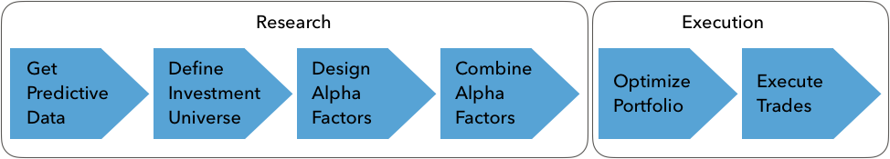
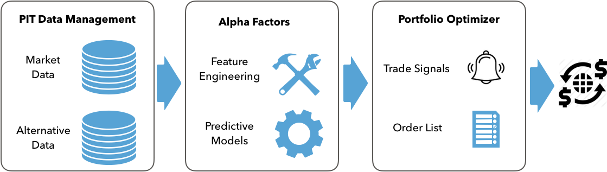

# Machine Learning for Trading (2nd edition, June 2020)

This book aims to show **how ML can add value to algorithmic trading strategies** in a practical yet comprehensive way. It covers a broad range of ML techniques from linear regression to deep reinforcement learning and demonstrates how to build, backtest and evaluate a trading strategy driven by model predictions.  

It is organized in **four parts with 23 chapters** plus appendix that cover: 
- important aspects of data sourcing, **financial feature engineering**, and portfolio management, 
- the design and evaluation of long-short strategies based on fundamental **supervised and unsupervised ML** algorithms
- extracting tradeable signals from **financial text data** like SEC filings, earnings call transcripts or financial news
- using **deep learning** models like CNN and RNN with financial and alternative data, generating synthetic data with generative adversarial networks, and training a trading agent using deep reinforcement learning

This repo contains **over 150 notebooks** that that put the concepts, algorithms and use cases discussed in the book into action. They contain numerous examples that show 
- how to work with and extract signals from market, fundamental and alternative text and image date, 
- how to train and tune models that predict returns for different asset classes and investment horizons, including how to replicate recently published research, and 
- how to design, backtest, and evaluate trading strategies.

## What to expect

This book aims to equip you with a strategic perspective, conceptual understanding, and practical tools to add value when applying ML to the trading and investment process. To this end, we cover ML as a key element in a process rather than a standalone exercise. Most importantly, we introduce an end-to-end ML for trading (ML4T) workflow that we apply to numerous use cases with relevant data and code examples.

The ML4T workflow starts with generating ideas and sourcing data and continues to extracting features, tuning ML models, and designing trading strategies that act on the models’ predictive signals. It also includes the simulation of strategies on historical data using a backtesting engine and the evaluation of their performance.

First and foremost, the book demonstrates how you can extract signals from a diverse set of data sources and design trading strategies for different asset classes using a broad range of supervised, unsupervised, and reinforcement learning algorithms. In addition, it provides relevant mathematical and statistical background to facilitate the tuning of an algorithm or the interpretation of the results. Finally, it includes financial background to enable you to work with market and fundamental data, extract informative features, and manage the performance of a trading strategy.

## What's new in the second edition

The second edition emphasizes the end-to-end ML4t workflow, reflected in a new chapter on [strategy backtesting](08_ml4t_workflow/README.md), a new [appendix](24_alpha_factor_library/README.md) describing over 100 different alpha factors, and many new practical applications. We have also rewritten most of the existing content for clarity and readability.  

The applications now use a broader range of data sources beyond daily US equity prices, including international stocks and ETFs, as well as minute-frequency equity data to demonstrate an intraday strategy. Also, there is now broader coverage of alternative data sources, including SEC filings for sentiment analysis and return forecasts, as well as satellite images to classify land use. 

Furthermore, the book replicates several applications recently published in academic papers. Chapter 18 demonstrates how to apply convolutional neural networks to time series converted to image format for return predictions. [Chapter 20](20_autoencoders_for_conditional_risk_factors/README.md) shows how to extract risk factors conditioned on stock characteristics for asset pricing using autoencoders based on [Autoencoder Asset Pricing Models](https://www.aqr.com/Insights/Research/Working-Paper/Autoencoder-Asset-Pricing-Models) by Shihao Gu, Bryan T. Kelly, and Dacheng Xiu (2019), and Chapter 21 shows how to create synthetic training data using generative adversarial networks based on [Time-series Generative Adversarial Networks](https://papers.nips.cc/paper/8789-time-series-generative-adversarial-networks) by Jinsung Yoon, Daniel Jarrett, and Mihaela van der Schaar (2019).

All applications now use the latest available (at the time of writing) software versions such as pandas 1.0 and TensorFlow 2.2. There is also a customized version of Zipline that makes it easy to include machine learning model predictions when designing a trading strategy.

## Installation and Data Sources

- For instructions on using a Docker image or setting up various `conda` environments to install the packages used in the notebooks, see [here](installation/README.md).
- To download and preprocess many of the data sources used in this book see [create_datasets](data/create_datasets.ipynb).

# Summary of the Content

The book has four parts that cover different aspects of the data sourcing and strategy development process, as well as different solutions to various ML4T challenges.

## Part 1: From Data to Strategy Development

The first part provides a framework for the development of trading strategies driven by machine learning (ML). It focuses on the data that power the ML algorithms and strategies discussed in this book, outlines how ML can be used to derive trading signals, and how to deploy and evaluate strategies as part of a portfolio.

### 01 Machine Learning for Trading: From Idea to Execution

This [chapter](01_machine_learning_for_trading) explores industry trends that have led to the emergence of ML as a source of competitive advantage in the investment industry. We will also look at where ML fits into the investment process to enable algorithmic trading strategies. More specifically, we will be covering the following topics:
- Key trends behind the rise of ML in the investment industry
- The design and execution of a trading strategy that leverages ML
- Popular use cases for ML in trading

### 02 Market & Fundamental Data: Sources and Techniques

This [chapter](02_market_and_fundamental_data) shows how to work with market and fundamental data sources and describes key aspects of the environment in which they are created. Familiarity with various types of orders and the trading infrastructure matters not only for the interpretation of the data, but also because they affect backtest simulations of a trading strategy. We also illustrate how to use Python to access and work with trading and financial statement data.  In particular, this chapter covers:

- How market data reflects the structure of the trading environment
- Working with intraday trade and quotes data at minute frequency
- Reconstructing the **limit order book** from tick data using NASDAQ ITCH 
- Summarizing tick data using various types of bars
- Working with eXtensible Business Reporting Language (XBRL)-encoded **electronic filings**
- Parsing and combining market and fundamental data to create a P/E series
- How to access various market and fundamental data sources using Python

### 03 Alternative Data for Finance: Categories and Use Cases

This [chapter](03_alternative_data) outlines categories and describes criteria to assess the exploding number of alternative data sources and providers. It also demonstrates how to create alternative data sets by scraping websites, for example to collect earnings call transcripts for use with natural language processing (NLP) and sentiment analysis algorithms in the second part of the book. More specifically, this chapter covers:

- Which new sources of information have been unleashed by the alternative data revolution
- How individuals, business processes, and sensors generate alternative data
- Evaluating the burgeoning supply of alternative data used for algorithmic trading
- Working with alternative data in Python, such as by scraping the internet
- Important categories and providers of alternative data

### 04 Financial Feature Engineering: How to research Alpha Factors

If you are already familiar with ML, you know that feature engineering is a key ingredient for successful predictions. This is no different in trading. Investment, however, is particularly rich in decades of research into how markets work and which features may work better than others to explain or predict price movements as a result. This [chapter](04_alpha_factor_research) provides an overview as a starting point for your own search for alpha factors.

This chapter  presents key tools that facilitate the computing and testing alpha factors. We will highlight how the NumPy, pandas and TA-Lib libraries facilitate the manipulation of data and present popular smoothing techniques like the wavelets and the Kalman filter that help reduce noise in data. After reading this chapter you will know about:
- Which categories of factors exist, why they work, and how to measure them
- Creating e alpha factors using NumPy, pandas, and TA-Lib
- How to denoise data using wavelets and the Kalman filter
- Using e Zipline offline and on Quantopian to test individual and multiple alpha factors
- How to use Alphalens to evaluate predictive performance and turnover using, among other metrics, the information coefficient (IC)
 
### 05 Portfolio Optimization and Performance Evaluation

Alpha factors generate signals that an algorithmic strategy translates into trades, which, in turn, produce long and short positions. The returns and risk of the resulting portfolio determine the success of the strategy.

There are several approaches to optimize portfolios that include the application of machine learning (ML) to learn hierarchical relationships among assets and treat their holdings as complements or substitutes with respect to the portfolio risk profile. This chapter covers:
- How to measure portfolio risk and return
- Managing portfolio weights using mean-variance optimization and alternatives
- Using machine learning to optimize asset allocation in a portfolio context
- Simulating trades and create a portfolio based on alpha factors using Zipline
- How to evaluate portfolio performance using pyfolio

## Part 2: Machine Learning for Trading: Fundamentals

The second part covers the fundamental supervised and unsupervised learning algorithms and illustrates their application to trading strategies. It also introduces the Quantopian platform where you can leverage and combine the data and ML techniques developed in this book to implement algorithmic strategies that execute trades in live markets.

### 06 The Machine Learning Process

this [chapter](06_machine_learning_process) sets the stage by outlining how to formulate, train, tune and evaluate the predictive performance of ML models as a systematic workflow. It covers:

- How supervised and unsupervised learning from data works
- Training and evaluating supervised learning models for regression and classification tasks
- How the bias-variance trade-off impacts predictive performance
- How to diagnose and address prediction errors due to overfitting
- Using cross-validation to optimize hyperparameters with a focus on time-series data
- Why financial data requires additional attention when testing out-of-sample

### 07 Linear Models: From Risk Factors to Return Forecasts

Linear models are applied to regression and classification problems with the goals of inference and prediction. Numerous asset pricing models developed by academia and industry are based on linear regression. Applications include identifying significant factors that drive asset returns, for example, as a basis for risk management, as predicting returns over various time horizons. Classification problems, on the other hand, include directional price forecasts. [Chapter 07](07_linear_models) covers the following topics:

- How linear regression works and which assumptions it makes
- Training and diagnosing linear regression models
- Using linear regression to predict stock returns
- Use regularization to improve the predictive performance
- How logistic regression works
- Converting a regression into a classification problem

### 08 The ML4T Workflow: From Model to Strategy Backtesting

The goal of this [chapter](08_ml4t_workflow) is to present an end-to-end perspective on the process of designing, simulating, and evaluating a trading strategy driven by an ML algorithm. To this end, we will demonstrate in more detail how to backtest an ML-driven strategy in a historical market context using the Python libraries backtrader and Zipline. More specifically, after working through this chapter you will be able to:
- Plan and implement end-to-end strategy backtesting
- Understand and avoid critical pitfalls when implementing backtests
- Discuss the advantages and disadvantages of vectorized vs event-driven backtesting engines
- Identify and evaluate the key components of an event-driven backtester
- Design and execute the ML4T workflow using data sources at minute and daily frequencies, with ML models trained separately or as part of the backtest
- Use Zipline and backtrader to design and evaluate your own strategies 

### 09 Time Series Models for Volatility Forecasts and Statistical Arbitrage

 This [chapter](09_time_series_models) focuses on models that extract signals from previously observed data to predict future values for the same time series. The time dimension of trading makes the application of time series models to market, fundamental, and alternative data very popular. 
 
 We present tools to diagnose time series characteristics, including stationarity, and extract features that capture potential patterns. Then it introduces univariate and multivariate time series models and how to apply them to forecast macro data and volatility patterns. It concludes with the concept of cointegration and how to apply it to develop a pairs trading strategy.

In particular, we will cover the following topics:
- How to use time series analysis to diagnose diagnostic statistics that inform the modeling process
- How to estimate and diagnose autoregressive and moving-average time series models
- How to build Autoregressive Conditional Heteroskedasticity (ARCH) models to predict volatility
- How to build vector autoregressive models
- How to use cointegration for a pairs trading strategy

### 10 Bayesian ML: Dynamic Sharpe Ratios and Pairs Trading

This [chapter](10_bayesian_machine_learning) introduces how Bayesian approaches to machine learning add value when developing and evaluating trading strategies due to their different perspective on uncertainty. More specifically, this chapter covers:

- How Bayesian statistics apply to machine learning
- How to use probabilistic programming with PyMC3
- How to define and train machine learning models
- How to run state-of-the-art sampling methods to conduct approximate inference
- How to apply Bayesian machine learning to compute dynamic Sharpe ratios, build Bayesian classifiers, and estimate stochastic volatility

### 11 Random Forests: A Long-Short Strategy for Japanese Stocks

This [chapter](11_decision_trees_random_forests) shows how decision trees and random forests can be used for trading. We will see how decision trees learn rules from data that encodes non-linear relationships between the input and the output variables. We also  introduce ensemble models that combine multiple individual models to produce a single aggregate prediction with lower prediction-error variance. In short, in this chapter, we will cover:
- How to use decision trees for regression and classification
- How to gain insights from decision trees and visualize the decision rules learned from the data
- Why ensemble models tend to deliver superior results
- How bootstrap aggregation addresses the overfitting challenges of decision trees
- How to train, tune, and interpret random forests

### 12 Boosting your Trading Strategy

This [chapter](12_gradient_boosting_machines) explores boosting, an alternative tree-based ensemble algorithm that often produces better results. The key difference is that boosting modifies the data that is used to train each tree based on the cumulative errors made by the model before adding the new tree. In contrast to random forests, which train many trees independently from each other using different versions of the training set, boosting proceeds sequentially using reweighted versions of the data. State-of-the-art boosting implementations also adopt the randomization strategies of random forests. 

More specifically, in this chapter we will cover the following topics:
- How boosting works, and how it compares to bagging
- How boosting has evolved from adaptive to gradient boosting (GB)
- How to use and tune AdaBoost and GB models with sklearn
- How state-of-the-art GB implementations speed up computation
- How to prevent overfitting of GB models
- How to build, tune, and evaluate GB models using xgboost, lightgbm, and catboost
- How to interpret and gain insights from GM models using [SHAP](https://github.com/slundberg/shap) values

### 13 Data-Driven Risk Factors and Asset Allocation with Unsupervised Learning

Dimensionality reduction and clustering are the main tasks for unsupervised learning: 
- Dimensionality reduction transforms the existing features into a new, smaller set while minimizing the loss of information. A broad range of algorithms exists that differ by how they measure the loss of information, whether they apply linear or non-linear transformations or the constraints they impose on the new feature set. 
- Clustering algorithms identify and group similar observations or features instead of identifying new features. Algorithms differ in how they define the similarity of observations and their assumptions about the resulting groups.

More specifically, this [chapter](13_unsupervised_learning) covers:
- how principal and independent component analysis perform linear dimensionality reduction
- how to apply PCA to identify risk factors and eigen portfolios from asset returns 
- how to use non-linear manifold learning to summarize high-dimensional data for effective visualization
- how to use T-SNE and UMAP to explore high-dimensional alternative image data
- how k-Means, hierarchical, and density-based clustering algorithms work
- how to apply agglomerative clustering to build robust portfolios according to hierarchical risk parity

## Part 3: Natural Language Processing for Trading

Text data are rich in content, yet unstructured in format and hence require more preprocessing so that a machine learning algorithm can extract the potential signal. The key challenge consists in converting text into a numerical format for use by an algorithm, while simultaneously expressing the semantics or meaning of the content. We will cover several techniques that capture nuances of language readily understandable to humans so that they can be used as input for machine learning algorithms.

### 14 Text Data for Trading: Sentiment Analysis

This [chapter](14_working_with_text_data) introduces text feature extraction techniques that focus on individual semantic units, i.e. words or short groups of words called tokens. We will show how to represent documents as vectors of token counts by creating a document-term matrix that in turn serves as input for text classification and sentiment analysis. We will also introduce the Naive Bayes algorithm that is popular for this purpose. 

In particular, in this chapter covers:
- What the NLP workflow looks like
- How to build a multilingual feature extraction pipeline using spaCy and Textblob
- How to perform NLP tasks like parts-of-speech tagging or named entity recognition
- How to convert tokens to numbers using the document-term matrix
- How to classify text using the Naive Bayes model
- How to perform sentiment analysis

### 15 Topic Modeling: Summarizing Financial News

This chapter uses unsupervised learning to model latent topics and extract hidden themes from documents. These themes can produce detailed insights into a large body of documents in an automated way. They are very useful to understand the haystack itself and permit the concise tagging of documents because using the degree of association of topics and documents. 

Topic models permit the extraction of sophisticated, interpretable text features that can be used in various ways to extract trading signals from large collections of documents. They speed up the review of documents, help identify and cluster similar documents, and can be annotated as a basis for predictive modeling. Applications include the identification of key themes in company disclosures or earnings call transcripts, customer reviews or contracts, annotated using, e.g., sentiment analysis or direct labeling with subsequent asset returns. More specifically, this chapter covers:
- What topic modeling achieves, why it matters and how it has evolved
- How Latent Semantic Indexing (LSI) reduces the dimensionality of the DTM
- How probabilistic Latent Semantic Analysis (pLSA) uses a generative model to extract topics
- How Latent Dirichlet Allocation (LDA) refines pLSA and why it is the most popular topic model
- How to visualize and evaluate topic modeling results
- How to implement LDA using sklearn and gensim
- How to apply topic modeling to collections of earnings calls and Yelp business reviews

### 16 Word embeddings for Earnings Calls and SEC Filings

This chapter introduces uses neural networks to learn a vector representation of individual semantic units like a word or a paragraph. These vectors are dense rather than sparse as in the bag-of-words model and have a few hundred real-valued rather than tens of thousand binary or discrete entries. They are called embeddings because they assign each semantic unit a location in a continuous vector space.
 
Embeddings result from training a model to relate tokens to their context with the benefit that simigslar usage implies a similar vector. As a result, the embeddings encode semantic aspects like relationships among words by means of their relative location. They are powerful features for use in the deep learning models that we will introduce in the following chapters. More specifically, in this chapter, we will cover:
- What word embeddings are, how they work and capture semantic information
- How to use trained word vectors
- Which network architectures are useful to train word2vec models
- How to train a word2vec model using keras, gensim, and TensorFlow
- How to visualize and evaluate the quality of word vectors
- How to train a word2vec model using SEC filings
- How doc2vec extends word2vec

## Part 4: Deep & Reinforcement Learning

### 17 Deep Learning for Trading

This [chapter](17_deep_learning) presents feedforward neural networks (NN) to demonstrate how to efficiently train large models using backpropagation, and manage the risks of overfitting. It also shows how to use of the frameworks Keras, TensorFlow 2.0, and PyTorch.

In the following chapters, we will build on this foundation to design and train a variety of architectures suitable for different investment applications with a particular focus on alternative data sources. These include recurrent NN tailored to sequential data like time series or natural language and convolutional NN particularly well suited to image data. We will also cover deep unsupervised learning, including Generative Adversarial Networks (GAN) to create synthetic data and reinforcement learning to train agents that interactively learn from their environment. In particular, this chapter will cover
- How DL solves AI challenges in complex domains
- How key innovations have propelled DL to its current popularity
- How feed-forward networks learn representations from data
- How to design and train deep neural networks in Python
- How to implement deep NN using Keras, TensorFlow, and PyTorch
- How to build and tune a deep NN to predict asset prices

### 18 CNN for Financial Time Series and Satellite Images

CNNs are named after the linear algebra operation called convolution that replaces the general matrix multiplication typical of feed-forward networks. Research into CNN architectures has proceeded very rapidly and new architectures that improve performance on some benchmark continue to emerge frequently. CNNs are designed to learn hierarchical feature representations from grid-like data. One of their shortcomings is that they do not learn spatial relationships, i.e., the relative positions of these features. In the last section, we will outline how Capsule Networks work that have emerged to overcome these limitations. 

More specifically, this [chapter](18_convolutional_neural_nets) covers

- How CNNs use key building blocks to efficiently model grid-like data
- How to design CNN architectures using Keras and PyTorch
- How to train, tune and regularize CNN for various data types
- How to use transfer learning to streamline CNN, even with fewer data

### 19 RNN for Multivariate Time Series and Sentiment Analysis

The major innovation of RNN is that each output is a function of both previous output and new data. As a result, RNN gain the ability to incorporate information on previous observations into the computation it performs on a new feature vector, effectively creating a model with memory. This recurrent formulation enables parameter sharing across a much deeper computational graph that includes cycles. Prominent architectures include Long Short-Term Memory (LSTM) and Gated Recurrent Units (GRU) that aim to overcome the challenge of vanishing gradients associated with learning long-range dependencies, where errors need to be propagated over many connections. 

RNNs have been successfully applied to various tasks that require mapping one or more input sequences to one or more output sequences and are particularly well suited to natural language. RNN can also be applied to univariate and multivariate time series to predict market or fundamental data. This chapter covers how RNN can model alternative text data using the word embeddings that we covered in [Chapter 16](16_word_embeddings) to classify the sentiment expressed in documents. Most specifically, this chapter addresses:
- How to unroll and analyze the computational graph for an RNN
- How gated units learn to regulate an RNN’s memory from data to enable long-range dependencies
- How to design and train RNN for univariate and multivariate time series in Python
- How to leverage word embeddings for sentiment analysis with RNN

### 20 Autoencoders for Conditional Risk Factors and Asset Pricing

This [chapter](20_autoencoders_and_gans) shows how unsupervised learning can leverage deep learning for trading. More specifically, we’ll discuss autoencoders that have been around for decades but recently attracted fresh interest.

An autoencoder is a neural network trained to reproduce the input while learning a new representation of the data, encoded by the parameters of a hidden layer. Autoencoders have long been used for nonlinear dimensionality reduction and manifold learning (see Chapter 13). A variety of designs leverage the feedforward, convolutional, and recurrent network architectures we covered in the last three chapters. We will see how autoencoders can underpin a trading strategy: we will build a deep neural network that uses an autoencoder to extract risk factors and predict equity returns, conditioned on a range of equity attributes (Gu, Kelly, and Xiu 2020).

More specifically, in this chapter you will learn about:
- Which types of autoencoders are of practical use and how they work
- Building and training autoencoders using Python
- Using autoencoders to extract data-driven risk factors that take into account asset characteristics to predict returns

### 21 Generative Adversarial Nets for Synthetic Time Series Data

This chapter introduces a second unsupervised deep learning technique after presenting autoencoders in the last chapter. More specifically, we’ll introduce generative adversarial networks (GANs) that were invented by Goodfellow et al. in 2014. Yann LeCun has called GANs the “most exciting idea in AI in the last ten years.” 

A GAN trains two neural nets, called generator and discriminator, in a competitive setting. The generator aims to produce samples that the discriminator is unable to distinguish from a given class of training data. The result is a generative model capable of producing synthetic samples representative of a certain target distribution but artificially and, thus, cheaply created.

GANs have produced an avalanche of research and successful applications in many domains. While originally applied to images, Esteban, Hyland, and Rätsch (2017) applied GANs to the medical domain to generate synthetic time-series data. Experiments with financial data ensued (Koshiyama, Firoozye, and Treleaven 2019; Wiese et al. 2019; Zhou et al. 2018; Fu et al. 2019) to explore whether GANs can generate data that simulate alternative asset price trajectories to train supervised or reinforcement algorithms, or to backtest trading strategies. We will replicate the Time-Series GAN presented at the 2019 NeurIPS by Yoon, Jarrett, and van der Schaar (2019) to illustrate the approach and demonstrate the results.

More specifically, in this chapter you will learn about:
- How GANs work, why they are useful, and how they could be applied to trading
- Designing and training GANs using TensorFlow 2
- Generating synthetic financial data to expand the inputs available for training ML models and backtesting

### 22 Deep Reinforcement Learning: Building a Trading Agent

Reinforcement Learning (RL) is a computational approach to goal-directed learning performed by an agent that interacts with a typically stochastic environment which the agent has incomplete information about. RL aims to automate how the agent makes decisions to achieve a long-term objective by learning the value of states and actions from a reward signal. The ultimate goal is to derive a policy that encodes behavioral rules and maps states to actions.

This [chapter](20_reinforcement_learning) shows how to formulate an RL problem and how to apply various solution methods. It covers model-based and model-free methods, introduces the [OpenAI Gym](https://gym.openai.com/) environment, and combines deep learning with RL to train an agent that navigates a complex environment. Finally, we'll show you how to adapt RL to algorithmic trading by modeling an agent that interacts with the financial market while trying to optimize an objective function. 

More specifically,this chapter will cover:

- How to define a Markov Decision Problem (MDP)
- How to use Value and Policy Iteration to solve an MDP
- How to apply Q-learning in an environment with discrete states and actions
- How to build and train a deep Q-learning agent in a continuous environment
- How to use OpenAI Gym to train an RL trading agent

### 23 Conclusions and Next Steps

### 24 Appendix - Alpha Factor Library