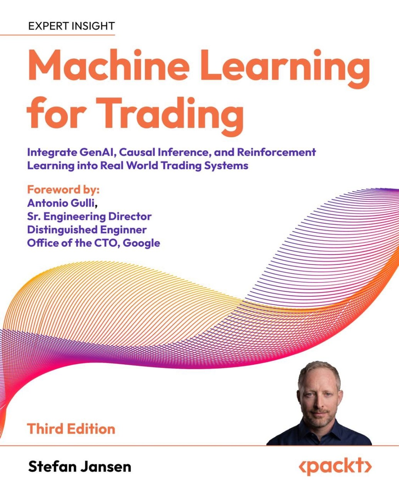
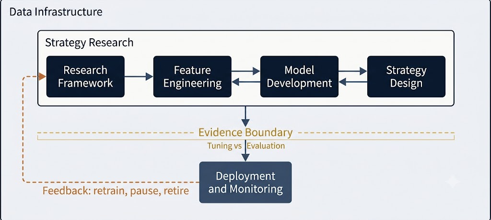

# Machine Learning for Trading — 3rd Edition

**Build, test, and deploy ML-driven trading strategies — from data sourcing to live execution.**

This repository hosts the code for [*Machine Learning for Trading, 3rd Edition*](https://amzn.to/4eigy2F)
by [Stefan Jansen](https://www.linkedin.com/in/applied-ai/) — a ground-up
rebuild, organized around one end-to-end workflow: how you define a research idea and develop it iteratively into a
strategy you can actually run, and keep running, in a live market.

- [Nine case studies](https://www.ml4trading.io/case-studies/) illustrate the workflow throughout the 27 chapters of the
  book, from raw data through features, models, backtests, costs, and risk to deployment.
- **Generative AI** and **autonomous agents** are new to this edition and cut across that workflow, bringing
  retrieval-augmented generation, knowledge graphs, and multi-agent systems to financial research.
- The [companion website](https://ml4trading.io) features [112 primers](https://ml4trading.io/primer/),
  [56 agent skills](https://ml4trading.io/skills/),
  and [six production Python libraries](https://ml4trading.io/libraries/)
  that facilitate substantial parts of the workflow.

> For the first time, we are offering [live cohort courses](https://ml4trading.io/courses/), plus free lightning
> lessons on [multi-agent systems](https://maven.com/p/6c2609/build-multi-agent-systems-you-can-audit) and
> [From Trading Idea to Validated Strategy](https://maven.com/p/7a8c60/from-trading-idea-to-validated-strategy?utm_medium=ll_share_link&utm_source=instructor)
> are coming up on **June 24, 2026**.

  

---

## What's New in the Third Edition

The whole book traces one path: from data infrastructure and strategy research, across an *evidence boundary* that
separates tuning from evaluation, to deployment and monitoring — with a feedback loop that retrains, pauses, or
retires a strategy as its edge decays.

  

Where earlier editions moved technique by technique, the third edition runs that one process end to end — and adds
substantial new material:

- **A wider model toolkit**: from gradient boosting (XGBoost, LightGBM, CatBoost) to deep time-series architectures
  (PatchTST, iTransformer, TSMixer, TCN, Mamba) and newer tabular and latent-factor models (TabPFN, TabM, conditional
  and supervised autoencoders).
- **Dedicated strategy-design chapters**: transaction costs and risk management are now full chapters, neither of
  which existed before, joining portfolio construction and strategy synthesis so a raw signal is carried through to a
  sized, cost- and risk-aware portfolio.
- **A full production track**: live trading systems (Interactive Brokers, Alpaca, QuantConnect), MLOps and governance
  (drift detection, safe rollout, circuit breakers, feature stores, experiment tracking), and the operational reality
  of *running* strategies, not just building them.
- **Generative AI**: retrieval-augmented generation grounded in SEC filings, knowledge graphs and Graph RAG, and
  autonomous, multi-agent research systems.
- **Causal machine learning**: Double ML, Bayesian structural time series, and causal discovery for separating real
  effects from spurious correlation.
- **Reinforcement learning**: optimal execution, market making with inventory, and deep hedging.
- **Synthetic financial data**: TimeGAN, Tail-GAN, Sig-CWGAN, and diffusion-based generators for validation when
  history is short.

Methodological rigor is treated as a first-class topic rather than an afterthought. The book draws an explicit line
between exploration and confirmation — the *evidence boundary* — uses walk-forward cross-validation throughout, and
confronts the multiple-testing and overfitting problems that quietly invalidate most backtests, with tools like the
Deflated Sharpe Ratio, the Rademacher Anti-Serum, and White's Reality Check, plus conformal prediction for honest
uncertainty estimates.

The data layer moves to **Polars** for fast, expression-based manipulation, and every chapter ships in **reproducible
Docker environments** so results repeat across machines; PyTorch, LightGBM, Optuna, and Plotly round out the modeling
and visualization stack.

### Nine Case Studies

The structural centerpiece of the third edition is **nine case studies** that run the length of the
book. ETFs, crypto
perpetuals, intraday equities, options, FX, futures, and equity factor panels are each carried through the *same*
pipeline — from raw data and labels to features, models, backtests, costs, risk overlays, and a final deployment
assessment. One disciplined process applied to nine very different markets shows where it works, where it breaks, and
why.

| Case Study               | Asset Class        | Frequency | What It Explores                                                             |
|--------------------------|--------------------|-----------|------------------------------------------------------------------------------|
| ETFs                     | Multi-asset ETFs   | Daily     | Cross-asset momentum and mean-reversion across 100 ETFs                      |
| Crypto Perps             | Crypto             | 8-hourly  | Funding-rate arbitrage on perpetual futures                                  |
| NASDAQ-100               | Equities           | 15-min    | Intraday microstructure signals from order flow and the LOB                  |
| S&P 500 Equity + Options | Equities + Options | Daily     | Equity selection enhanced with implied-volatility features                   |
| US Firm Characteristics  | Equities           | Monthly   | Firm-level characteristics panel (size, value, momentum, quality)            |
| FX Pairs                 | FX                 | Daily     | Carry and momentum across major currency pairs                               |
| CME Futures              | Futures            | Daily     | Term-structure and roll-yield signals across commodity and financial futures |
| S&P 500 Options          | Options            | Daily     | Options-only strategies (straddles, delta-hedged positions)                  |
| US Equities              | Equities           | Daily     | Broad cross-section of US stocks with classic factor exposures               |

### 112 Primer Topics

Free concept explainers for every idea the book relies on. Each part links to its full list; a few topics show the
range:

- [Foundations](https://ml4trading.io/primer/): 8 topics spanning limit order book mechanics, bitemporal data models,
  and the stylized facts a simulator must reproduce.
- [Research Design and Feature Engineering](https://ml4trading.io/primer/): 21 topics, including multiple testing in
  factor research, fractional differencing, and path signatures for financial sequences.
- [Model Development](https://ml4trading.io/primer/): 22 topics, among them regularization geometry, conformal
  prediction in finance, and the mechanism behind double machine learning.
- [Strategy Implementation](https://ml4trading.io/primer/): 27 topics, from the deflated Sharpe ratio and hierarchical
  risk parity to Almgren-Chriss optimal execution.
- [Advanced AI](https://ml4trading.io/primer/): 8 topics such as Markov decision processes, the policy-gradient theorem,
  and proper scoring rules for event forecasts.
- [Production](https://ml4trading.io/primer/): 2 topics, champion-challenger evaluation and training-serving skew with
  feature stores.
- [Cross-cutting concepts](https://ml4trading.io/primer/): 20 building blocks referenced across chapters, for example
  momentum and mean reversion, the bias-variance tradeoff, and walk-forward validation.

### 56 Agent Skills

Reusable, guard-railed tasks for coding agents, each with built-in defenses against lookahead bias, data leakage, and
multiple-testing errors. Each category links to its full set; a few skills show the range:

- [Concepts](https://ml4trading.io/skills/): 10 skills, including lookahead bias, data leakage, and the information
  coefficient.
- [Data Acquisition](https://ml4trading.io/skills/): 7 skills spanning fetching data, building bars, and data
  validation.
- [Feature Engineering](https://ml4trading.io/skills/): 10 skills, among them computing features, triple-barrier labels,
  and feature selection.
- [Evaluation & Validation](https://ml4trading.io/skills/): 8 skills, from walk-forward CV and purging-and-embargo to
  the deflated Sharpe ratio.
- [Backtesting](https://ml4trading.io/skills/): 5 skills such as running backtests, cost models, and tear sheets.
- [Portfolio Management](https://ml4trading.io/skills/): 5 skills, including position sizing, risk metrics, and kill
  switches.
- [Infrastructure](https://ml4trading.io/skills/): 4 skills, for example the canonical schema, the registry system, and
  Polars patterns.
- [Workflows](https://ml4trading.io/skills/): 5 skills covering factor research, model validation, and production
  readiness.
- [Production](https://ml4trading.io/skills/): 2 skills, live trading and monitoring & alerting.

### Courses

[Cohort-based courses](https://ml4trading.io/courses/) on [Maven](https://maven.com/stefan-jansen) that work through
the material live, with direct feedback:

- [Machine Learning for Trading: From Research to Production](https://maven.com/stefan-jansen/research-to-production):
  take a research idea all the way to a deployed, monitored strategy.
- [Building Multi-Agent Forecasting Systems](https://maven.com/stefan-jansen/forecasting-agents):
  design auditable multi-agent systems for financial research.

Each course runs as a scheduled cohort; the links above always point to the next one, where you can enroll or join the
waitlist. *Stay current between cohorts with the
twice-weekly [**Insights** newsletter](https://insights.ml4trading.io/).*

---

## The ML4T Libraries

The notebooks are built on six production Python packages, each documented and usable on its own — one per stage of
the workflow:

| Library                                                     | Stage      | What it does                                                                   |
|-------------------------------------------------------------|------------|--------------------------------------------------------------------------------|
| [`ml4t-data`](https://ml4trading.io/docs/data/)             | Data       | Unified market-data acquisition from 19+ providers behind one interface        |
| [`ml4t-engineer`](https://ml4trading.io/docs/engineer/)     | Signal     | Features, labels, alternative bars, and leakage-safe dataset preparation       |
| [`ml4t-models`](https://ml4trading.io/docs/models/)         | Models     | Finance-native latent factors, SDFs, direct prediction, and portfolio learning |
| [`ml4t-diagnostic`](https://ml4trading.io/docs/diagnostic/) | Evaluation | Feature validation, strategy diagnostics, and the Deflated Sharpe Ratio        |
| [`ml4t-backtest`](https://ml4trading.io/docs/backtest/)     | Strategy   | Event-driven backtesting with realistic execution                              |
| [`ml4t-live`](https://ml4trading.io/docs/live/)             | Deployment | Production trading with broker integrations                                    |

---

An introduction and a closing chapter bookend six workflow-aligned parts.

## Introduction

### 1. The Process Is Your Edge

Why process discipline beats model sophistication. Introduces the ML4T workflow as a research-to-production system,
regime detection on factor returns and macro indicators, and the evidence boundary that separates exploration from
confirmation.

## Part I — Financial Data (Chapters 2–5)

The markets, instruments, and infrastructure the rest of the book builds on: a taxonomy of sources, raw exchange
messages turned into feature-ready bars, point-in-time fundamentals, and synthetic histories for robust validation.

### 2. The Financial Data Universe

A taxonomy of market, fundamental, and alternative data. Surveys eight asset classes, quantifies survivorship bias,
benchmarks storage formats (Parquet, DuckDB, kdb+, TimescaleDB), and establishes the data-quality framework used
throughout the book.

### 3. Market Microstructure

From raw exchange messages to feature-ready bars. Parses NASDAQ ITCH, reconstructs limit order books from multiple
data sources, validates Lee-Ready trade classification, and compares bar-sampling methods — dollar bars deliver the
best return normality.

### 4. Fundamental and Alternative Data

Point-in-time pipelines for SEC EDGAR filings, entity resolution across identifier systems, macro and commodity
fundamentals, and alternative-data evaluation — including on-chain crypto fundamentals and prediction markets
(Kalshi, Polymarket).

### 5. Synthetic Financial Data

Generating alternative market histories for robust validation. Implements TimeGAN, Tail-GAN, Sig-CWGAN,
Diffusion-TS, and LLM-based tabular generation, evaluated through a fidelity–utility–privacy framework.

## Part II — Research Design and Feature Engineering (Chapters 6–10)

Define the trading problem, then turn data into model-ready signals: research design, labels, features, and the
evaluation that determines what any model can learn.

### 6. Strategy Research Framework

Defining the trading game before building models: universe rules, decision schedule, cost model, evaluation
protocol, and run logging. Introduces the nine case studies and the walk-forward cross-validation discipline that
anchors Chapters 7–20.

### 7. Defining the Learning Task

Label engineering (forward returns, triple-barrier, trend scanning), univariate feature evaluation (information
coefficients, quantile analysis, feasibility screens), multiple-testing control (BH-FDR, Deflated Sharpe Ratio),
and causal plausibility checks.

### 8. Financial Feature Engineering

Five feature families from price data (momentum, reversal, volatility, liquidity, microstructure), structural and
cross-instrument features (yield curve, term structure, relative value), contextual features (macro regime, calendar,
sentiment), and feature selection with robustness testing.

### 9. Model-Based Feature Extraction

Features from fitted models: stationarity diagnostics, Kalman filters, Fourier and wavelet spectral features, GARCH
volatility, and HMM regime probabilities — with point-in-time correctness enforced throughout.

### 10. Text Feature Engineering

From bag-of-words through transformers: TF-IDF, Word2Vec and GloVe embeddings, LSTM sequence models, FinBERT
sentiment, financial NER fine-tuning, and news-return signal construction.

## Part III — Model Development (Chapters 11–15)

Five model families applied to the same nine case studies, each building on the linear baseline.

### 11. The ML Pipeline

Regularized linear models (Ridge, LASSO, Elastic Net) as the baseline every later model must beat. Logistic
regression for direction, SHAP interpretability, conformal prediction for uncertainty, and a cross-dataset
comparison across all nine case studies.

### 12. Gradient Boosting and Advanced Tabular Models

XGBoost, LightGBM, and CatBoost with Optuna multi-objective tuning, plus deep-learning tabular alternatives (TabPFN,
TabM). TreeSHAP explainability and cross-dataset results, where gradient boosting is the strongest tabular model in
most case studies.

### 13. Deep Learning for Time Series

LSTM, N-BEATS, Transformers (PatchTST, iTransformer, TFT), TSMixer, TCN, and Mamba, set against the LTSF-Linear
debate. A practitioner selection framework and cross-dataset evidence on when deep learning helps and when simpler
models suffice.

### 14. Latent Factor Models

PCA eigenportfolios, IPCA with time-varying loadings, conditional and supervised autoencoders, adversarial SDF
estimation, and yield-curve decomposition — with cross-dataset results on when latent factors add predictive value.

### 15. Causal Machine Learning

Double Machine Learning for isolating factor treatment effects, Bayesian Structural Time Series for event impact, and
causal discovery (PCMCI, NOTEARS, VAR-LiNGAM), applied across the nine case studies.

## Part IV — Strategy Implementation (Chapters 16–20)

From predictions to deployable strategies — backtesting, portfolio construction, costs, risk, and synthesis.

### 16. Strategy Simulation

Backtesting as falsification: trading-protocol specification, vectorized vs event-driven engines, an ETF baseline
strategy, core metric reporting, regime diagnostics, and strategy-level overfitting control (Deflated Sharpe Ratio,
Rademacher Anti-Serum, White's Reality Check).

### 17. Portfolio Construction

From scores to portfolios: mean-variance optimization and its pitfalls, Hierarchical Risk Parity, the Kelly
criterion, conformal position sizing, deep portfolio allocation, and a controlled allocator comparison across case
studies.

### 18. Transaction Costs

Cost taxonomy, spread estimation, market-impact calibration, execution algorithms (VWAP, TWAP, Almgren-Chriss
optimal execution), transaction-cost analysis, and practical guardrails — with breakeven costs that vary widely by
asset class.

### 19. Risk Management

VaR/CVaR tail measurement, drawdown and path-risk controls, factor and sector decomposition, stress testing,
adaptive risk overlays, deep hedging, and kill switches. Overlay effectiveness turns out to be strategy-specific.

### 20. Strategy Synthesis

What nine experiments reveal about translating ML predictions into strategies: IC–Sharpe decorrelation, Fundamental
Law diagnostics, the model-family cascade, cost-survival analysis, holdout failure modes, and a practitioner's
decision framework.

## Part V — Advanced AI (Chapters 21–24)

Reinforcement learning, large language models, knowledge graphs, and autonomous agents for finance.

### 21. Reinforcement Learning for Execution and Hedging

MDP formulation for finance, DQN/PPO/SAC algorithms, optimal execution, market making with inventory management, deep
hedging with PFHedge, inverse RL for strategy recovery, and the sim-to-real gap.

### 22. RAG for Financial Research

Retrieval-augmented generation grounded in SEC filings: ingestion, domain-specific embeddings, hybrid retrieval with
re-ranking, constraint-based prompting, RAG evaluation and failure diagnostics, and the transition to agentic
workflows.

### 23. Knowledge Graphs

When graphs earn their infrastructure cost: KG construction from SEC filings, Graph RAG for multi-hop reasoning,
graph features for ML (GNN embeddings, centrality, community detection), financial networks, and temporal-leakage
prevention.

### 24. Autonomous Agents

Agent architectures (ReAct, Tree of Thoughts, Reflexion), memory systems, tool contracts, the engineering stack
(LangGraph, Claude SDK), a stateful equity-research agent, multi-agent forecasting with adversarial debate, and
production reliability.

## Part VI — Production (Chapters 25–26)

Taking strategies live — trading systems and the operational infrastructure that keeps them running.

### 25. Live Trading Systems

A unified framework bridging research and production: Interactive Brokers and Alpaca integration, managed platforms
(QuantConnect), order-lifecycle management, pipeline verification, and operational readiness.

### 26. MLOps and Governance

An ML failure taxonomy (pipeline divergence vs performance decay), drift detection, safe model rollout, circuit
breakers, feature stores, experiment tracking, and the MLOps infrastructure financial ML systems need.

## Conclusion

### 27. The Systematic Edge

The systematic philosophy, quant career paths, learning resources, research frontiers, and how to build your own
edge. The closing bookend to Chapter 1: the process is the edge.

---

## Releases

New chapters and notebooks are added over the coming weeks. ⭐ Watch or star the repo to follow along, and subscribe to
the twice-weekly [**Insights** newsletter](https://insights.ml4trading.io/).

**Free Lightning Lessons — Wednesday, June 24, 2026:**

- [Build Multi-Agent Systems You Can Audit](https://maven.com/p/6c2609/build-multi-agent-systems-you-can-audit) — 15:00 UTC
- [From Trading Idea to Validated Strategy](https://maven.com/p/7a8c60/from-trading-idea-to-validated-strategy?utm_medium=ll_share_link&utm_source=instructor) — 16:00 UTC

The live cohort course
[**Machine Learning for Trading: From Research to Production**](https://maven.com/stefan-jansen/research-to-production)
starts **July 6, 2026** and works through this workflow live, with direct feedback.

**Looking for the second edition?** It is complete and stable on the `second-edition` branch —
`git checkout second-edition`, and everything is exactly where the book describes it.

---

## Contributing and Feedback

Found an error, a broken link, or have a suggestion? Early feedback is especially valuable before the book launches.

- **Issues**: [open a GitHub issue](https://github.com/stefan-jansen/machine-learning-for-trading/issues)
- **Website and contact**: [ml4trading.io](https://ml4trading.io)

---

## License

Code: [MIT License](LICENSE) · Book content: © 2026 Stefan Jansen. All rights reserved.

  <a href="https://amzn.to/4eigy2F">Get the book</a> •
  <a href="https://ml4trading.io">ml4trading.io</a> •
  <a href="https://github.com/stefan-jansen/machine-learning-for-trading">GitHub</a>

